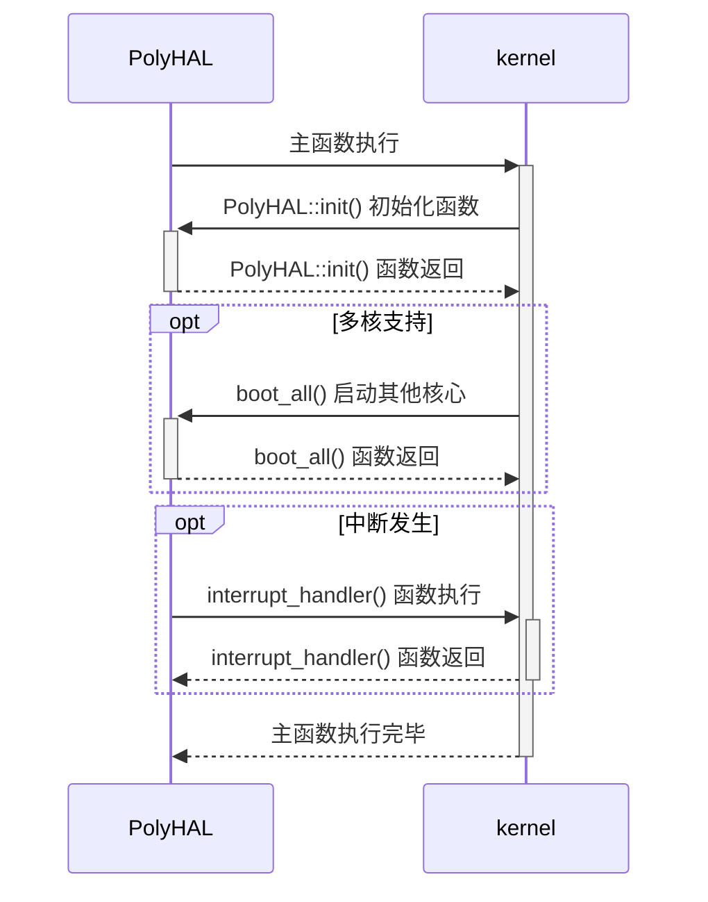
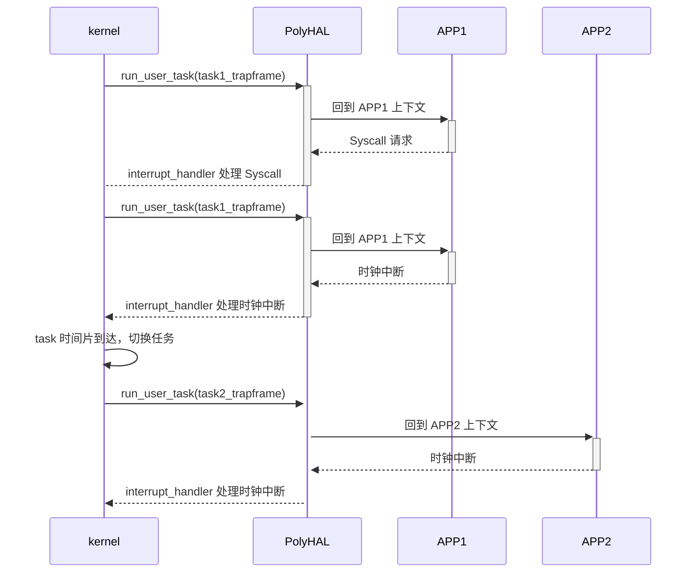

## mermaid diagram

```mermaid
sequenceDiagram
    PolyHAL->>+kernel: 主函数执行
    kernel->>+PolyHAL: PolyHAL::init() 初始化函数
    PolyHAL-->>-kernel: PolyHAL::init() 函数返回
    opt 多核支持
    kernel ->>+PolyHAL: boot_all() 启动其他核心
    PolyHAL -->> -kernel: boot_all() 函数返回
	end
	opt 中断发生
    PolyHAL ->> +kernel: interrupt_handler() 函数执行
    kernel -->> -PolyHAL: interrupt_handler() 函数返回
	end
    kernel-->>-PolyHAL: 主函数执行完毕
```

```mermaid
sequenceDiagram
    kernel ->> + PolyHAL: run_user_task(task1_trapframe)
    PolyHAL ->> + APP1: 回到 APP1 上下文
    APP1 -->> -PolyHAL: Syscall 请求
    PolyHAL --> -kernel: interrupt_handler 处理 Syscall
    kernel ->> + PolyHAL: run_user_task(task1_trapframe)
    PolyHAL ->> + APP1: 回到 APP1 上下文
    APP1 -->> -PolyHAL: 时钟中断
    PolyHAL -->> -kernel: interrupt_handler 处理时钟中断
    kernel ->> kernel: task 时间片到达，切换任务
    kernel ->> + PolyHAL: run_user_task(task2_trapframe)
    PolyHAL ->> + APP2: 回到 APP2 上下文
    APP2 -->> -PolyHAL: 时钟中断
    PolyHAL -->>kernel: interrupt_handler 处理时钟中断
```
