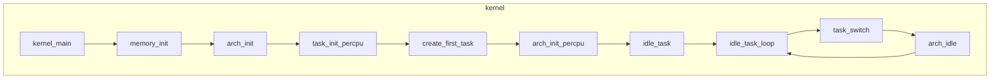
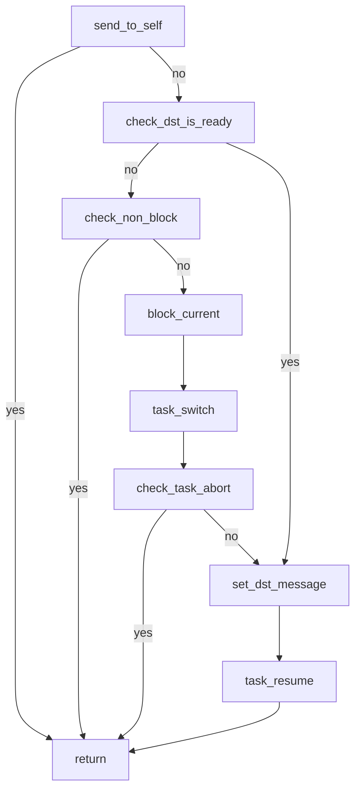

## HinaOS init



`memory_init` 初始化 `free` 内存 和 `mmio` 地址。
从 `task_switch` 开始切换任务和调度

## IPC

#### `send_message`




`check_dst_is_ready` will check dest task Blocked and wait for ipc.

## syscall

```c
#define SYS_IPC 1
#define SYS_NOTIFY 2
#define SYS_SERIAL_WRITE 3
#define SYS_SERIAL_READ 4
#define SYS_TASK_CREATE 5
#define SYS_TASK_DESTROY 6
#define SYS_TASK_EXIT 7
#define SYS_TASK_SELF 8
#define SYS_PM_ALLOC 9
#define SYS_VM_MAP 10
#define SYS_VM_UNMAP 11
#define SYS_IRQ_LISTEN 12
#define SYS_IRQ_UNLISTEN 13
#define SYS_TIME 14
#define SYS_UPTIME 15
#define SYS_HINAVM 16
#define SYS_SHUTDOWN 17
```