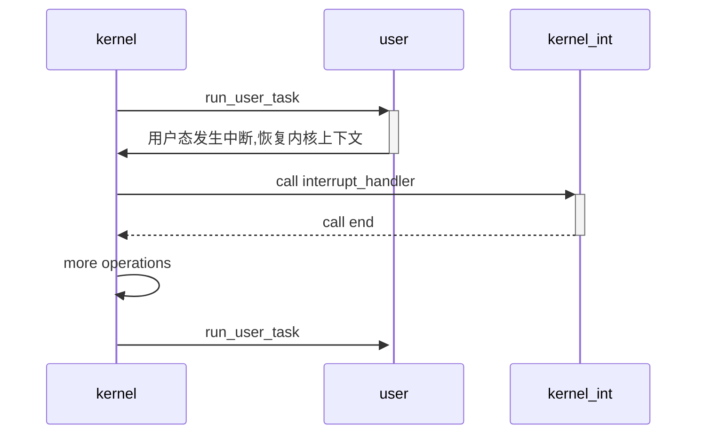
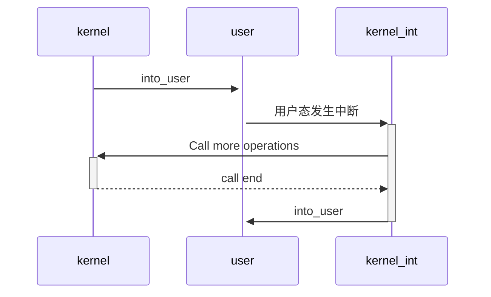

## Return to user mode

For now, use the `user_restore` function to get back to user mode, and will return to next instruction when return to kernel mode.

So I want to write the `into_user` function in the TrapFrame and just return to kernel mode.

But how to implement rust `async` Scheduling function based on this modal? 

How's that going?

What should I do if I want to return the` into_user`'s next instruction after returning to kernel mode?
Write a function `KContext::save_current`?

Like this:

```rust
fn user_entry() {
	let kcontet = current_task().get_kcontext_mut();
	kcontext[KContextArgs::SEPC] = todo!("move function to next line of into_user");
	current_task().get_trap_frame().into_user();
	info!("should return to here when trigger a exception");
}
```

How about wrapping this logic into `polyhal`?

## add function `into_user`

when into user it will push kernel context into kernel stack. or add a function `into_user_with_context`

when trigger a interrupt, the assembly will record the `sp` register, then pass it to `interrupt_handler`.

For Async



For no-Async, should was this


## For no-MMU design

If we want to add a compatible for no MMU device, I think we should add a function named `go_higher_half_kernel`, this function will jump to the higher vspace. 

Of course, we should add a config that should control the status of mmu, if we add `mmu=false`, then `polyhal` will auto close mmu usage.

## x86_64 polyhal IOAPIC

example code:

```c
void setup_ioapic_entry(int irq, int vector, int apic_id, int trigger_mode, int polarity) {
    int index = 0x10 + 2 * irq;
    uint32_t low = vector | (apic_id << 24);
    uint32_t high = apic_id << 24;
    if (trigger_mode) low |= (1 << 15);
    if (polarity) low |= (1 << 13);
    # cal result: 
    ioapic_write(index + 1, high);
    ioapic_write(index, low);
}

void configure_com_interrupt() {
    setup_ioapic_entry(4, 0x24, 0, 0, 0);  // Example for COM1 IRQ 4
}
```

Reference:

How to set up the APIC to get keyboard interrupts https://blog.wesleyac.com/posts/ioapic-interrupts

### PerCPU design

get the start of the section

like linkme

```rust
pub mod linux {
    use syn::Ident;

    pub fn section(ident: &Ident) -> String {
        format!("linkme_{}", ident)
    }

    pub fn section_start(ident: &Ident) -> String {
        format!("__start_linkme_{}", ident)
    }

    pub fn section_stop(ident: &Ident) -> String {
        format!("__stop_linkme_{}", ident)
    }
}

pub mod bsd {
    use syn::Ident;

    pub fn section(ident: &Ident) -> String {
        format!("linkme_{}", ident)
    }

    pub fn section_start(ident: &Ident) -> String {
        format!("__start_linkme_{}", ident)
    }

    pub fn section_stop(ident: &Ident) -> String {
        format!("__stop_linkme_{}", ident)
    }
}

pub mod macho {
    use syn::Ident;

    pub fn section(ident: &Ident) -> String {
        format!(
            "__DATA,__linkme{},regular,no_dead_strip",
            crate::hash(ident),
        )
    }

    pub fn section_start(ident: &Ident) -> String {
        format!("\x01section$start$__DATA$__linkme{}", crate::hash(ident))
    }

    pub fn section_stop(ident: &Ident) -> String {
        format!("\x01section$end$__DATA$__linkme{}", crate::hash(ident))
    }
}

pub mod windows {
    use syn::Ident;

    pub fn section(ident: &Ident) -> String {
        format!(".linkme_{}$b", ident)
    }

    pub fn section_start(ident: &Ident) -> String {
        format!(".linkme_{}$a", ident)
    }

    pub fn section_stop(ident: &Ident) -> String {
        format!(".linkme_{}$c", ident)
    }
}

pub mod illumos {
    use syn::Ident;

    pub fn section(ident: &Ident) -> String {
        format!("set_linkme_{}", ident)
    }

    pub fn section_start(ident: &Ident) -> String {
        format!("__start_set_linkme_{}", ident)
    }

    pub fn section_stop(ident: &Ident) -> String {
        format!("__stop_set_linkme_{}", ident)
    }
}
```

https://stackoverflow.com/questions/16552710/how-do-you-get-the-start-and-end-addresses-of-a-custom-elf-section

like hermit-rs core-local design

https://github.com/hermit-os/kernel/blob/76146147771d51a2797de571f814e5945fa9ea23/src/arch/x86_64/kernel/core_local.rs

extern macro design

https://github.com/Andy-Python-Programmer/aero/blob/master/src/aero_kernel/src/utils/mod.rs#L228

` offset = field_addr  __start_section_name` 

maybe offset_of will have some help.


### TLS

drop the value core::ptr::drop_in_place(to_drop)
